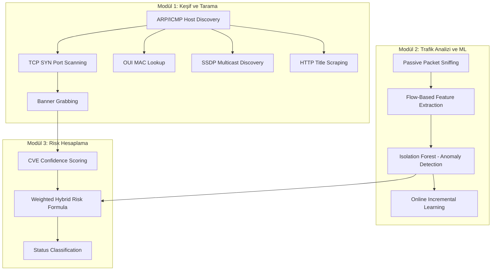
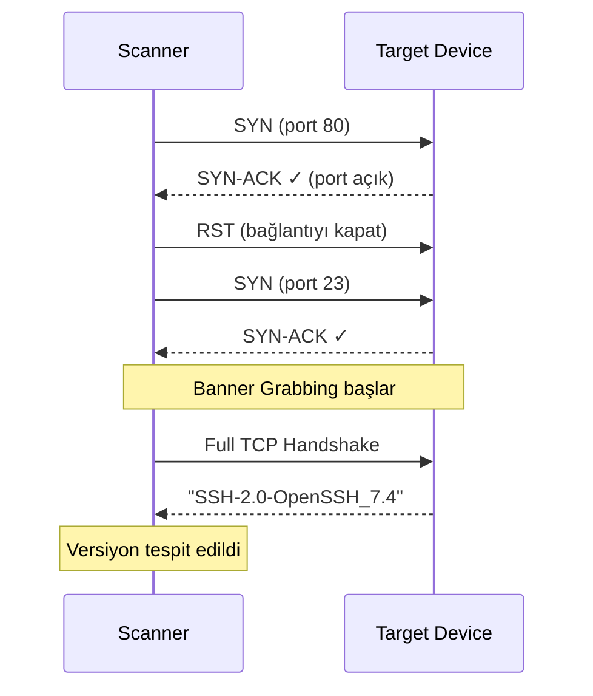
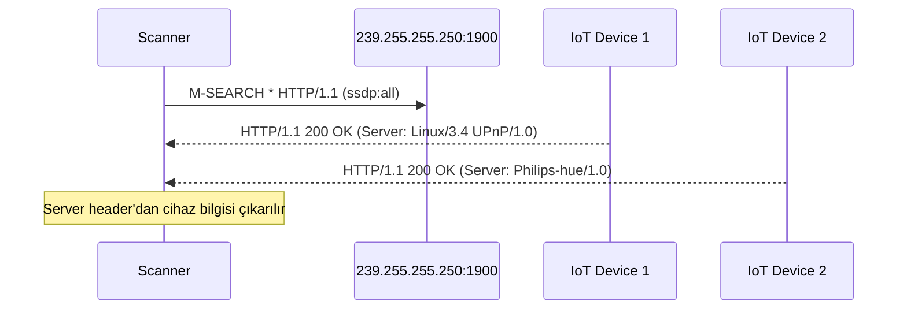
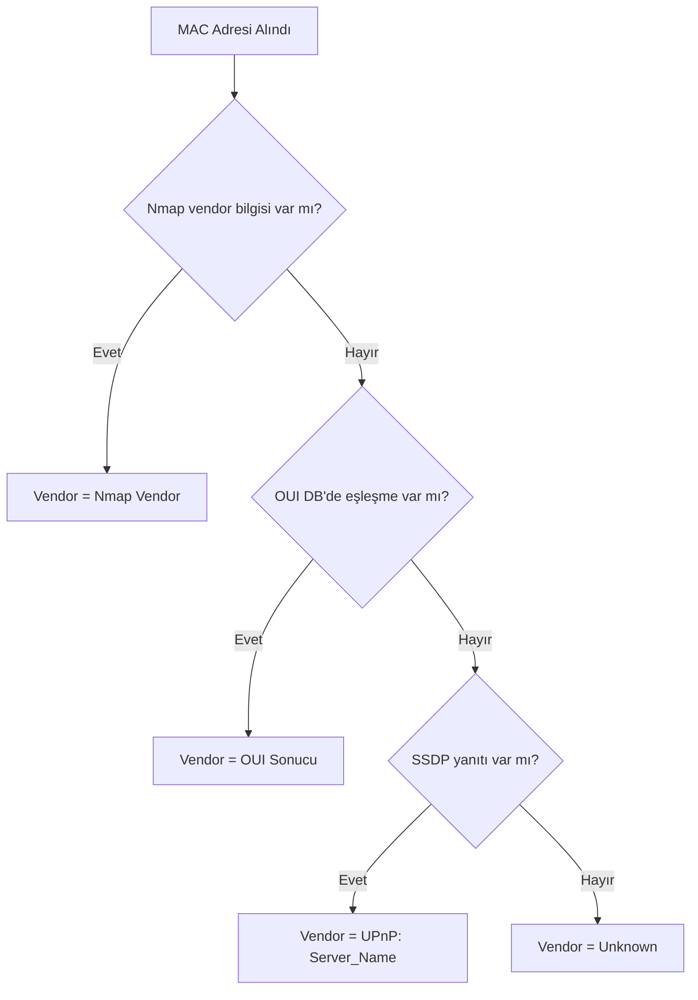

# SentinelIoT — Nihai Algoritma Raporu

**Tarih:** 27 Mart 2026 · **Proje:** SentinelIoT v5.0 (Nihai)

---

## Genel Algoritma Haritası



---

## 1. Host Discovery — ARP/ICMP Tarama

**Dosya:** [network_scan.py](file:///c:/Users/Hakit/Desktop/Bitirme%20Projesi/v3/sentinel_iot/scanner/network_scan.py)

### Algoritma
Nmap'in `-sn` (Ping Scan) modu kullanılır. Nmap, hedef aralıktaki tüm IP'lere şu sırayla paket gönderir:

1. **ARP Request** (yerel ağda) — Layer 2'de doğrudan MAC adresini sorgular
2. **ICMP Echo Request** (uzak ağda) — Klasik "ping"
3. **TCP SYN** (port 443) + **TCP ACK** (port 80) — ICMP engellenmiş hostları bulmak için

### Pseudocode

```
function discover_hosts(ip_range):
    local_ip = get_outbound_socket_ip("8.8.8.8")
    network = local_ip[0:3_octets] + ".0/24"
    
    for each ip in network:
        send ARP_REQUEST(ip)
        if ARP_REPLY received:
            device = {ip, mac, vendor}
            devices.append(device)
    
    return devices
```

### Ağ Aralığı Tespiti

```
Algoritma: UDP Socket → Connect → Get Local IP
Formül:   network = IP[0:3] + ".0/24"
Örnek:    192.168.1.45 → 192.168.1.0/24
```

> [!NOTE]
> Sabit `/24` subnet mask kullanılıyor. Bu, 256 adreslik bir aralığı tarar.

---

## 2. Port Scanning ve Servis Tespiti

**Dosya:** [vulnerability_scan.py](file:///c:/Users/Hakit/Desktop/Bitirme%20Projesi/v3/sentinel_iot/scanner/vulnerability_scan.py)

### Algoritma: TCP SYN Scan + Banner Grabbing



### Profil Tabanlı Tarama Stratejisi

| Profil | Nmap Argümanları | Hedef |
|--------|-----------------|-------|
| `quick` | `-sV -T4 -F` | Hızlı, top 100 port |
| `iot_discovery` | `-sV -p <IoT_ports> -T4` | IoT-spesifik portlar |
| [full](file:///c:/Users/Hakit/Desktop/Bitirme%20Projesi/v3/sentinel_iot/api/main.py#80-156) | `-sS -sV -p- -T4` | Tüm 65535 port |
| `vulnerability` | `-sV --script vulners -p <IoT_ports> -T3` | CVE taraması |

### Hedef IoT Port Listesi

```
22(SSH), 23(Telnet), 80(HTTP), 443(HTTPS), 554(RTSP),
1883(MQTT), 5353(mDNS), 5683(CoAP), 8883(MQTT-TLS),
9100(Raw Print), 34567(Xiongmai), 37777(Dahua)
```

### CVE Çıkarma Algoritması

```
function extract_cves(nmap_script_output):
    raw_text = stringify(script_output)
    cve_list = regex_findall("CVE-\d{4}-\d+", raw_text)
    return unique(cve_list)
```

Nmap'in `vulners` NSE scripti, tespit edilen servis versiyonunu Vulners veritabanında arar ve eşleşen CVE'leri döndürür.

---

## 3. Cihaz Parmak İzi (Device Fingerprinting)

**Dosya:** [device_fingerprint.py](file:///c:/Users/Hakit/Desktop/Bitirme%20Projesi/v3/sentinel_iot/scanner/device_fingerprint.py)

### 3.1 OUI MAC Address Lookup

MAC adresinin ilk 3 oktetini (24 bit) üretici veritabanında arar.

```
Algoritma: Dictionary Lookup
Girdi:    MAC = "C8:02:8F:A1:B2:C3"
İşlem:    prefix = "C8:02:8F"
Çıktı:    OUI_DICT["C8:02:8F"] → "Hikvision IP Camera"
```

### 3.2 SSDP/UPnP Multicast Discovery



**Protokol:** UDP multicast, adres `239.255.255.250`, port `1900`

```
function discover_ssdp():
    send UDP_MULTICAST("M-SEARCH ssdp:all") → 239.255.255.250:1900
    timeout = 3 seconds
    
    while responses_available:
        response = receive()
        ip = response.source_ip
        server = parse_header(response, "Server:")
        discovered[ip] = server
    
    return discovered
```

### 3.3 HTTP Title Scraping

Web arayüzü olan cihazlardan HTML `<title>` etiketini ve HTTP `Server` header'ını çeker.

```
function get_http_title(ip, port):
    url = (port == 80) ? "http://ip:port" : "https://ip:port"
    response = HTTP_GET(url, timeout=3s, verify_ssl=False)
    
    title = regex_search("<title>(.*?)</title>", response.body)
    server = response.headers["Server"]
    
    return (title, server)
```

### Birleşik Kimlik Çözümleme Sırası



---

## 4. Pasif Paket Yakalama

**Dosya:** [packet_capture.py](file:///c:/Users/Hakit/Desktop/Bitirme%20Projesi/v3/sentinel_iot/monitor/packet_capture.py)

### Algoritma: Promiscuous Mode Sniffing

Ağ arayüzünü "promiscuous mode"a alarak tüm trafiği yakalar (sadece cihaza gelen değil).

```
function start_capture(interface, duration, output_file):
    set_interface_promiscuous(interface)
    packets = []
    
    start_time = now()
    while (now() - start_time) < duration:
        packet = read_next_packet(interface)
        packets.append(packet)
        callback(packet)  // real-time işleme
    
    if output_file:
        write_pcap(output_file, packets)
        return output_file
    else:
        return packets  // in-memory
```

**Kütüphane:** Scapy, `sniff()` fonksiyonu Berkeley Packet Filter (BPF) kullanır.

---

## 5. Flow-Based Feature Extraction

**Dosya:** [feature_extractor.py](file:///c:/Users/Hakit/Desktop/Bitirme%20Projesi/v3/sentinel_iot/monitor/feature_extractor.py)

### Algoritma

Ham paketleri **network flow** (ağ akışı) bazında gruplar ve her flow için istatistiksel özellikler çıkarır.

### Flow Tanımı

```
Flow Key = (source_ip, destination_ip)
```

Aynı kaynak ve hedef IP'ye sahip tüm paketler bir flow oluşturur.

### Çıkarılan Özellikler (Feature Vector)

| Özellik | Formül | Açıklama |
|---------|--------|----------|
| `packet_count` | `Σ packets` | Flow'daki toplam paket sayısı |
| `byte_count` | `Σ len(packet)` | Toplam byte miktarı |
| `duration` | `t_last - t_first` | Flow süresi (saniye) |
| `avg_packet_size` | `byte_count / packet_count` | Ortalama paket boyutu |
| `mean_iat` | `μ(IAT)` | Paketler arası ortalama süre |
| `var_iat` | `σ²(IAT)` | Paketler arası süre varyansı |

> [!IMPORTANT]
> Tüm özellikler **[ml/feature_schema.py](file:///c:/Users/Hakit/Desktop/Bitirme%20Projesi/v3/sentinel_iot/ml/feature_schema.py)** dosyasındaki `FEATURE_SCHEMA` listesinde merkezi olarak tanımlanmıştır. Tüm modüller bu listeyi referans alır.

### Inter-Arrival Time (IAT) Hesaplama

```
IAT Dizisi:
  IAT[i] = timestamp[i] - timestamp[i-1]    (i > 0)

Ortalama IAT:
  mean_iat = (1/n) × Σ IAT[i]

Varyans IAT:
  var_iat = (1/(n-1)) × Σ (IAT[i] - mean_iat)²
```

### Pseudocode

```
function extract_features(packets):
    flows = {}
    
    for each packet with IP layer:
        key = (packet.src_ip, packet.dst_ip)
        flow = flows[key]
        
        flow.count += 1
        flow.bytes += len(packet)
        flow.update_timestamps(packet.time)
        
        if flow.has_previous_packet:
            iat = packet.time - flow.last_time
            flow.iats.append(iat)
        flow.last_time = packet.time
    
    features = []
    for each flow:
        features.append({
            packet_count, byte_count, duration,
            avg_packet_size, mean(iats), variance(iats)
        })
    
    return features
---

## 6. Isolation Forest — Anomali Tespiti

**Dosya:** [anomaly_model.py](file:///c:/Users/Hakit/Desktop/Bitirme%20Projesi/v3/sentinel_iot/ml/anomaly_model.py)

### 6.1 Algoritma Prensibi
Isolation Forest, **anomalilerin normal veriden daha kolay izole edilebildiği** varsayımına dayanır. Rastgele ikili karar ağaçları oluşturur ve her veri noktasının izole edilme derinliğini ölçer.

### 6.2 Anomaly Score Normalizasyonu (v5.0 Standardı)
Model çıktısı → Dashboard'da kullanılabilir skora dönüşüm:
```
decision_function(x) → raw_score  (Negatifler anomali)
normalized_score = max(0.0, min(1.0, 0.5 - raw_score))
```

### 7. Trafik Özellikleri ve Ölçeklendirme (Traffic Scale)
Cihaz sayısının ve trafik yoğunluğunun arttığı senaryolarda sistemin kilitlenmemesi için **Flow-Based Aggregation** uygulanmıştır.
- **Mantık:** Her bir paket tek tek işlenmek yerine, (Kaynak_IP, Hedef_IP) çiftleri bazında 5-10 saniyelik pencerelerde gruplanır.
- **Sonuç:** Saniyede 10.000 paketlik bir trafik, ML modeli için sadece ~50-100 satırlık bir "özet özellik setine" (Feature set) indirgenir. Bu da CPU yükünü %90 azaltır.

### 8. Ground Truth (Altın Veri) ve Etiketleme
Makine öğrenmesi modelinin başarısını ölçmek için kullanılan etiketleme stratejisi şöyledir:
- **Eğitim (Training):** [generate_dataset.py](file:///c:/Users/Hakit/Desktop/Bitirme%20Projesi/v3/sentinel_iot/ml/generate_dataset.py) ile üretilen sentetik saldırılar (DDoS, Scan, Exfil) otomatik olarak `is_anomaly=1` olarak etiketlenir. Bu, modelin "anomali nedir?" sorusunu öğrenmesini sağlar.
- **Çıkarım (Inference):** Canlı trafikte etiket yoktur; model (Isolation Forest) verinin "aykırılık" skoruna bakarak (Unsupervised) tahminde bulunur.

### 9. Zafiyet (CVE) Skorlama Kaynağı
Zafiyetlerin ciddiyetini belirlemek için şu hiyerarşi izlenir:
1. **Dinamik Kaynak:** Nmap `vulners.nse` scriptinin çıktısı regex ile taranır. Eğer script içinde bir CVSS puanı varsa (Örn: 9.8) o alınır.
2. **Fallback:** Puan bulunamazsa, Modül 1 gereksinimlerine uygun olarak baz puan `7.0` (Medium-High) atanır.
3. **Audit:** Fallback kullanılan her durum [api/main.py](file:///c:/Users/Hakit/Desktop/Bitirme%20Projesi/v3/sentinel_iot/api/main.py) loglarında "fallback CVSS used" olarak işaretlenir.

### 10. Dağıtım ve Güvenlik (Deployment & Auth)

#### 10.1 Dağıtım Topolojisi (Topology)
Sistem **Decoupled Architecture** (ayrıştırılmış mimari) üzerinde çalışır:
- **Backend:** FastAPI (Python), yerel ağdaki trafik yakalama (Scapy) ve tarama (Nmap) kütüphanelerine doğrudan erişimi olan bir ana bilgisayarda koşar.
- **Frontend:** React + Vite tabanlı panel, Backend'e RESTful API (JSON) üzerinden bağlanır.
- **Persistence:** SQLite tabanlı [sentinel_iot.db](file:///c:/Users/Hakit/Desktop/Bitirme%20Projesi/v3/sentinel_iot/sentinel_iot.db) yerel depolamada saklanır.

#### 10.2 Kimlik Doğrulama (Authentication)
- **Mevcut Durum:** Projenin v5.0 fazında dashboard "Güvenli Yerel Ağ" erişimine açık olacak şekilde tasarlanmıştır; henüz JWT aktif edilmemiştir.
- **Planlanan:** v6.0 sürümünde FastAPI OAuth2 (JWT) entegrasyonu ile panel girişli hale getirilecektir.

---

## 11. Gelişmiş Takip ve Metrikler

#### 11.1 Tarihsel Risk Kaydı (Persistence)
Hesaplanan her risk skoru, [risk_history](file:///c:/Users/Hakit/Desktop/Bitirme%20Projesi/v3/sentinel_iot/database/db.py#102-119) tablosunda zaman damgasıyla saklanır. Bu veri, Recharts kullanılarak **Risk History Trend** grafiğine dönüştürülür.

#### 11.2 Anomali Olay Akışı (Timeline)
`Isolation Forest` tarafından tespit edilen her anomali, detaylarıyla birlikte [anomaly_logs](file:///c:/Users/Hakit/Desktop/Bitirme%20Projesi/v3/sentinel_iot/database/db.py#139-155) tablosuna yazılır.

### 12. Güvenli State ve Asenkron İş Yönetimi

#### 12.1 Global State Lock (Concurrency Control)
[api/main.py](file:///c:/Users/Hakit/Desktop/Bitirme%20Projesi/v3/sentinel_iot/api/main.py) içindeki tüm paylaşılan değişkenler (`scan_status`, `devices_db`, [live_packets](file:///c:/Users/Hakit/Desktop/Bitirme%20Projesi/v3/sentinel_iot/api/main.py#233-238) vb.) `threading.Lock()` ile korunmaktadır.

#### 12.2 Job ID Sistemi
`/scan`, `/train` ve `/test-live/start` istekleri için asenkron bir `job_id` sistemi kullanılarak uzun süren işlemlerin durumu polling ile takip edilir.

### 13. Test ve Doğrulama
- **Compliance:** [test_compliance.py](file:///c:/Users/Hakit/Desktop/Bitirme%20Projesi/v3/sentinel_iot/tests/test_compliance.py) ile şema ve aralık doğrulaması.
- **E2E:** [test_end_to_end.py](file:///c:/Users/Hakit/Desktop/Bitirme%20Projesi/v3/sentinel_iot/tests/test_end_to_end.py) ile tarama ve 10-thread eşzamanlılık (stress) testleri.

### 14. Tehdit Senaryoları ve Veri Üretimi
ML model hassasiyeti için; **Port Scan**, **DDoS Flood** ve **Data Exfiltration** senaryoları sentetik veriseti üzerinden simüle edilir.

---
# Algoritma Özet Tablosu

| # | Algoritma | Modül | Karmaşıklık | Tip |
|---|-----------|-------|-------------|-----|
| 1 | ARP/ICMP Host Discovery | Scanner | O(n) | Ağ tarama |
| 2 | TCP SYN Port Scan | Scanner | O(n×p) | Ağ tarama |
| 3 | Banner Grabbing + Vulners CVE | Scanner | O(p) | Zafiyet tespiti |
| 4 | OUI Dictionary Lookup | Fingerprint | O(1) | Sınıflandırma |
| 5 | SSDP Multicast Discovery | Fingerprint | O(d) | Servis keşfi |
| 6 | HTTP Title Scraping | Fingerprint | O(1) | Bilgi toplama |
| 7 | BPF Packet Sniffing | Monitor | O(t) | Pasif izleme |
| 8 | Flow Aggregation + IAT | Feature Ext. | O(n) | Özellik çıkarma |
| 9 | Isolation Forest | ML | O(t×n×log n) | Anomali tespiti |
| 10 | Online Batch Re-training | ML | O(n×log n) | Adaptif öğrenme |
| 11 | CVE Confidence Scoring | Risk Engine | O(c) | Risk puanlama |
| 12 | Weighted Hybrid Fusion | Risk Engine | O(1) | Risk birleştirme |
| 13 | Plaintext Heuristic | API | O(b) | Payload analizi |

> n=paket sayısı, p=port sayısı, d=cihaz sayısı, t=ağaç sayısı, c=CVE sayısı, b=byte sayısı
