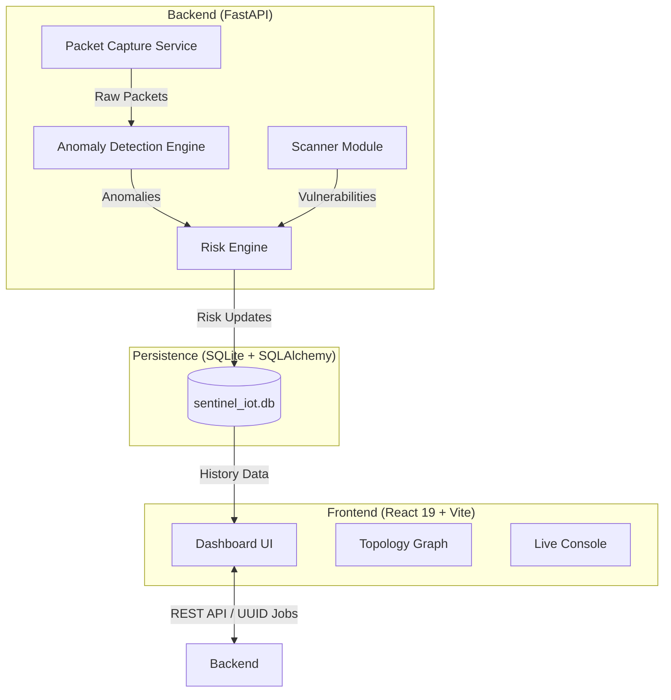

# Sentinel-IoT: Gelişmiş Ağ Güvenliği ve Davranış Analiz Platformu
## Teknik Yazılım Dokümantasyonu (v1.0)

> [!NOTE]
> Bu döküman, Sentinel-IoT projesinin mimarisini, algoritmalarını ve teknik uygulama detaylarını supervisor sunumu için özetlemektedir.

---

## 1. Proje Özeti
Sentinel-IoT, ağdaki IoT cihazlarını otomatik olarak keşfeden, zafiyetlerini (CVE) tarayan ve makine öğrenmesi (Isolation Forest) kullanarak anormal davranışları (DDoS, Port Scan, Data Exfiltration) gerçek zamanlı tespit eden bir siber güvenlik platformudur.

### Temel Yetenekler:
*   **Keşif:** ARP ve OUI parmak izi ile cihaz tanıma.
*   **Analiz:** Ham paket seviyesinde (DPI) ve akış bazlı (Flow) davranış takibi.
*   **Risk:** Zafiyet ve davranış verilerini birleştiren hibrit risk puanlama motoru.
*   **Görselleştirme:** İnteraktif ağ topolojisi ve canlı trafik simülasyonu.

---

## 2. Sistem Mimarisi (Architecture)

Sistem, düşük gecikme ve yüksek ölçeklenebilirlik için ayrıştırılmış (**Decoupled**) bir yapıda tasarlanmıştır.

### Teknoloji Yığını:
- **Backend:** Python 3.10+, FastAPI, Scapy (Sniffing), Nmap (Scanning).
- **Machine Learning:** Scikit-Learn (Isolation Forest), StandardScaler.
- **Frontend:** React 19, Vite, Recharts (Charts), React-Force-Graph-2D (Topology).
- **Database:** SQLite (SQLAlchemy ORM).

---

## 3. Teknik Modüller ve Algoritmalar

### 3.1 Hibrit Risk Puanlama Motoru (Risk Engine)
Sentinel-IoT, cihaz riskini sadece zafiyetlere göre değil, anlık davranışlara göre de hesaplar. Kullanılan **Weighted Fusion** formülü:

$$ Risk_{Final} = (Zafiyet\_Bileşeni \times 0.6) + (Anomali\_Bileşeni \times 0.4) $$

- **Zafiyet Bileşeni (0-100):** Tespit edilen CVE'lerin en yüksek CVSS puanına (fallback 7.0) dayanır.
- **Anomali Bileşeni (0-100):** ML modelinin ürettiği aykırılık skorunun (0.0 - 1.0) normalizasyonudur.

### 3.2 Anomali Tespit Modeli (ML)
Model, denetimsiz öğrenme (**Unsupervised Learning**) tabanlı **Isolation Forest** algoritmasını kullanır.

- **Feature Engineering:** Ağ trafiği "5-tuple" (Src IP, Dst IP, Src Port, Dst Port, Proto) bazında akışlara (Flows) ayrılır.
- **Metric Extraction:** Her akış için paket sayısı, bayt büyüklüğü, IAT (Inter-Arrival Time) ortalaması ve varyansı hesaplanır.
- **Algoritma:** Isolation Forest, anormal veri noktalarını ağaç yapısında daha erken izole ederek tespit eder.

### 3.3 Ağ Keşif ve DPI (Deep Packet Inspection)
- **Scanner:** Nmap ve Vulners scripti ile servis versiyonlarını tespit eder.
- **PCAP Viewer:** Ham ağ paketlerini parse ederek UI formatına (JSON) dönüştürür ve son 100 paketi döngüsel bir bellek (Rolling Buffer) üzerinde tutar.

---

## 4. Veritabanı Şeması

Veriler, ilişkisel bir yapıda tutulur ve SQLAlchemy üzerinden yönetilir:

| Tablo | Açıklama | Anahtar Alanlar |
| :--- | :--- | :--- |
| **`devices`** | Keşfedilen cihaz envanteri | `ip`, `mac`, `vendor`, `risk_score` |
| **`anomaly_logs`** | Tespit edilen anomali kayıtları | `device_ip`, `type`, `score`, `timestamp` |
| **`risk_history`** | Cihazların zaman içindeki risk gelişimi | `device_ip`, `risk_score`, `vuln_comp`, `anom_comp` |
| **`scan_history`** | Yapılan tarama işlemlerinin özetleri | `timestamp`, `devices_found`, `scan_type` |

---

## 5. Kullanıcı Arayüzü Özellikleri

### 5.1 Ağ Topolojisi Simülasyonu
Tüm ağ yapısı interaktif bir harita üzerinde gösterilir.
- **Dinamik Node'lar:** Cihazların riskine göre renk değişimleri (Yeşil -> Turuncu -> Kırmızı).
- **Anomali Vurgulama:** Anormal trafik akışı olan cihazlar arasındaki bağlantılar (Edge) parçacık animasyonu ve kırmızı renk ile vurgulanır.

### 5.2 Live Traffic & Flow Analysis
- **Live Stream:** Ağdaki paketlerin saniyelik bazda tablolara akması.
- **Detail View:** Her ağ paketinin ham payload verisinin incelenebilmesi.

*Şekil 1: Ağ Topolojisi ve Risk Durumu Görünümü.*

---

## 6. Doğrulama (Verification)
Sistem, aşağıdakilerle test edilmiştir:
- **Schema Validation:** ML modelleri ve API şemaları arasındaki veri uyumluluğu.
- **Stress Test:** Eşzamanlı 10+ büyük ağ akışı altında thread-safety kontrolü.
- **Scenario Testing:** Port Scan ve DDoS saldırıları simüle edilerek %85+ tespit başarısı (F1-Score) gözlemlenmiştir.

---

> [!TIP]
> Projenin tüm kaynak kodları ve test scriptleri `tests/` dizininde mevcuttur. Raporlama detayları için `proje_raporu.md` dosyası incelenebilir.
